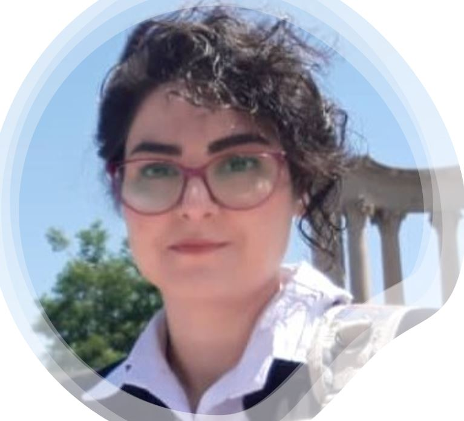

# **Fatemeh Kordi** #

## *Education* ##

- PhD Student of Geography at [*Clark University*](https://www.clarku.edu/)

- Master of Remote sensing and GIS at [*Tehran University*](https://ut.ac.ir/en)

- Bachelor of Natural Resource at [*Lorestan University*](https://en.lu.ac.ir/)

## *Research Interests* ##
1. Forests and climate change
1. land use change modeling
1. crop classification
1. Hydrology modeling
1. assessment of NCS opportunities in order to reduce carbon emission

